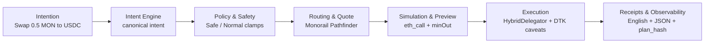

# 🚀 Pragma — Horizon 1

> **TL;DR:** Natural language swaps on Monad testnet. Type "swap 0.5 MON to USDC" and it just works—secured by delegation caveats, routed through Monorail, with full preview before execution.

**Pragma** is a product of [s0nderlabs](https://s0nderlabs.xyz). Try it live at [pr4gma.xyz](https://pr4gma.xyz).

Pragma turns short natural-language requests into guarded swaps on the Monad testnet. Horizon 1 (H1) focuses on **safe, delegated swaps** using MetaMask's Delegation Toolkit (DTK) and HybridDelegator (ERC-4337) smart accounts.

> 🌐 **100% Client-Side**: Pragma runs entirely in your browser/terminal. No backend server stores your data or keys. Session keys live in localStorage (web) or ~/.pragma (CLI). All operations are direct: Browser → Monorail API (quotes) → HyperRPC (simulation) → Monad RPC (execution).



---

## 🎯 Quickstart

### CLI (Terminal)

```bash
# 1. Install dependencies
pnpm install

# 2. Configure environment (see docs/getting-started/install.md for details)
cp .env.example .env
# Add: WEB3AUTH_CLIENT_ID, PIMLICO_API_KEY, MONORAIL_APP_ID, PRAGMA_ADMIN_TEST_PK, OPENAI_API_KEY

# 3. Launch the REPL
pnpm --filter @pragma/cli dev
```

**Try these commands:**
```bash
pragma onboard:4337              # Deploy smart account + issue delegation
pragma swap --amount 0.1 --from MON --to USDC
pragma receipts                  # View transaction history
```

> 💡 **Tip:** The REPL understands natural language! Try "swap half my MON to USDC" or "what's in my delegation?"


### Web Chat (Browser)

```bash
pnpm --filter web dev
# Opens http://localhost:3000
```

- Authenticate via Web3Auth or Privy
- Chat with the Pragma agent (powered by gpt-5-mini)
- Issue delegations, execute swaps, view receipts—all through conversation

> 📖 **Full setup guide:** [`docs/getting-started/install.md`](docs/getting-started/install.md)

---

## 🏗️ What You Get

| Feature | Description |
|---------|-------------|
| **🔐 Smart Accounts** | HybridDelegator (ERC-4337) with CREATE2 deployment |
| **💬 Natural Language** | "swap 0.5 MON to USDC" → executed swap |
| **🛡️ Safety Modes** | Safe (pair-locked, 1hr) or Normal (multi-token, 24hr) |
| **🔄 Delegation Management** | Revoke all, rotate keys, granular token controls |
| **📊 Full Preview** | See quote, slippage, gas before every swap |
| **📝 Receipt Trail** | English summaries + JSON records keyed by `plan_hash` |

<details>
<summary>🔍 Technical Details</summary>

### Architecture
- **Chain:** Monad testnet (chain_id = 10143)
- **Monorepo:** TypeScript workspace with CLI, Web, and Core packages
- **Stateless:** No database—everything reconstructed from artifacts

### Key Components
- **Intent Engine:** Parses natural language → canonical intents (with gpt-5-mini enhancement)
- **Routing:** Monorail Pathfinder for optimal swap paths
- **Execution:** MetaMask DTK + Pimlico bundler for gasless UserOperations
- **Observability:** HyperRPC (reads), HyperSync (streaming), structured receipts

</details>

---

## 📚 Documentation

### Getting Started
- [🔧 Installation & Environment Setup](docs/getting-started/install.md)
- [🎮 CLI Basics (REPL vs Commands)](docs/getting-started/cli.md)
- [💻 Web Console Guide](docs/getting-started/web.md)
- [🚪 Onboarding Flow](docs/getting-started/onboarding.md)

### Core Concepts
- [📖 System Overview](docs/overview.md)
- [🔄 Swap Flow Walkthrough](docs/flows/swap.md)
- [🧠 Intent Engine Deep Dive](docs/system-layers/intent-engine.md)
- [🛡️ Policy & Safety](docs/system-layers/policy-and-safety.md)

### Reference
- [⚡ CLI Command Reference](docs/reference/cli-reference.md)
- [🔌 API Reference](docs/reference/api-reference.md)
- [⚙️ Provider Configuration](docs/appendix/providers.md)
- [🔮 Future Roadmap](docs/appendix/future-roadmap.md)

---

## 🛠️ Tech Stack

| Layer | Technology |
|-------|------------|
| **Frontend** | Next.js 15, React 19, Tailwind CSS 4 |
| **Backend** | Node.js, TypeScript, pnpm workspaces |
| **Blockchain** | viem, wagmi, MetaMask DTK |
| **Infrastructure** | Pimlico (bundler/paymaster), Monorail (routing), Envio (HyperRPC/HyperSync) |
| **AI** | OpenAI gpt-5-mini (agent insights) |

> 📖 **Details:** See [Architecture Reference](docs/reference/architecture.md) for implementation specifics.

---

## 🤝 Need Help?

- **Issues:** [GitHub Issues](https://github.com/your-org/pragma/issues)
- **Docs:** Start with [`docs/overview.md`](docs/overview.md)
- **Internal:** See `internal-docs/` for design history and frozen baseline

---

**Version:** Horizon 1 (H1)
